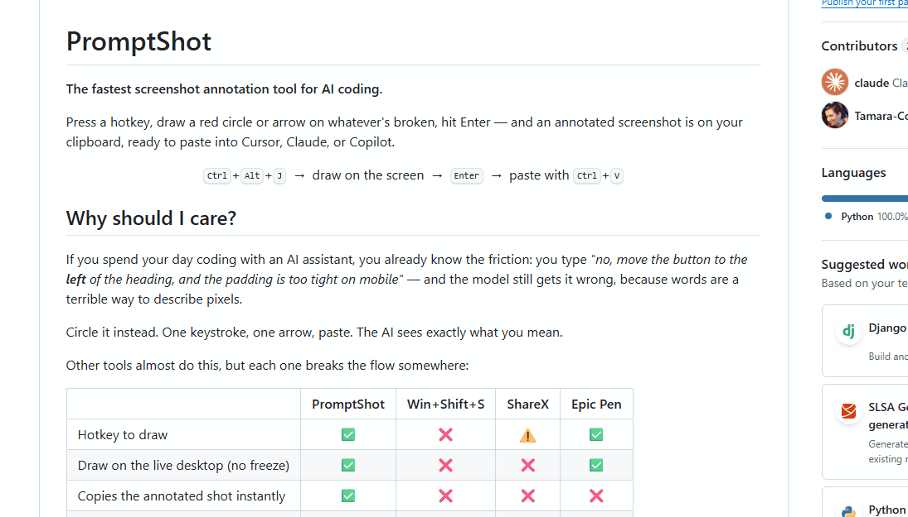

# PromptShot

**The fastest screenshot annotation tool for AI coding.**

Press a hotkey, draw a red circle or arrow on whatever's broken, hit Enter — and an
annotated screenshot is on your clipboard, ready to paste into Cursor, Claude, or Copilot.

<p align="center">
  <kbd>Ctrl</kbd>+<kbd>Alt</kbd>+<kbd>J</kbd> &nbsp;→&nbsp; draw on the screen &nbsp;→&nbsp; <kbd>Enter</kbd> &nbsp;→&nbsp; paste with <kbd>Ctrl</kbd>+<kbd>V</kbd>
</p>

## Why should I care?

If you spend your day coding with an AI assistant, you already know the friction: you type
*"no, move the button to the **left** of the heading, and the padding is too tight on
mobile"* — and the model still gets it wrong, because words are a terrible way to describe
pixels.

Circle it instead. One keystroke, one arrow, paste. The AI sees exactly what you mean.

Other tools almost do this, but each one breaks the flow somewhere:

|                                      | **PromptShot** | Win+Shift+S | ShareX | Epic Pen |
|--------------------------------------|:--------------:|:-----------:|:------:|:--------:|
| Hotkey to draw                       |       ✅       |      ❌     |   ⚠️   |    ✅    |
| Draw on the live desktop (no freeze) |       ✅       |      ❌     |   ❌   |    ✅    |
| Copies the annotated shot instantly  |       ✅       |      ❌     |   ❌   |    ❌    |
| No editor window to open             |       ✅       |      ❌     |   ❌   |    ✅    |

PromptShot is the only one built for the *"point at it and paste"* loop — the desktop stays
live while you draw, and the result is on your clipboard the instant you press Enter.

## See it in action

<!-- Record the loop (Ctrl+Alt+J → draw a red arrow → Enter → Ctrl+V into a Claude/Cursor
     chat) with ScreenToGif, save it as demo.gif in the repo root, and uncomment the line
     below. -->
<!-- <p align="center"></p> -->

> 🎬 _Demo clip landing here shortly._

## Install

**Needs Windows + [Python 3.9+](https://www.python.org/downloads/windows/).**

```powershell
git clone https://github.com/Tamara-Codes/promptshot.git
cd promptshot
python -m pip install -r requirements.txt
pythonw promptshot_daemon.pyw
```

That's it — it's now running in the background. Dependencies are just **Pillow** and
**pywin32**, and there's **no global keystroke hook** (the hotkey is a single chord
registered with the Win32 `RegisterHotKey` API), so it never watches what you type.

## Use it

1. **Ctrl+Alt+J** — the screen dims.
2. **Draw** red marks with the left mouse button.
3. **Enter** — the annotated screenshot is copied to your clipboard.
4. **Ctrl+V** into your AI chat. (Or **Esc** to cancel.)

---

## The two ways to run it

**Resident daemon (recommended)** — `pythonw promptshot_daemon.pyw`. Runs invisibly with
Python already loaded, so the overlay appears **instantly** on Ctrl+Alt+J. Use `pythonw`
(not `python`) so there's no console window.

**Single-shot fallback** — `pythonw promptshot.pyw`. Opens the overlay once and exits, no
hotkey and no background process. Bind it to a shortcut key yourself if you prefer.

## Start automatically on login

1. Press `Win+R`, type `shell:startup`, press Enter — this opens your Startup folder.
2. Right-click → **New → Shortcut**, and for the target use the **full path** to `pythonw`
   plus the script:

   ```
   "C:\Path\To\pythonw.exe" "C:\Path\To\promptshot\promptshot_daemon.pyw"
   ```

## Configuration

Edit the constants near the top of either script:

| Constant     | Default     | Meaning                                        |
|--------------|-------------|------------------------------------------------|
| `PEN_COLOR`  | `"#ff0000"` | Colour of your marks                           |
| `PEN_WIDTH`  | `4`         | Stroke width in pixels                         |
| `DIM_LEVEL`  | `0.40`      | Overlay dimness (0.0 = invisible, 1.0 = black) |

To **rebind the hotkey** (daemon), change `MODIFIERS` and `VK_KEY` near the top of
`promptshot_daemon.pyw`. `VK_KEY` is a Windows
[virtual-key code](https://learn.microsoft.com/windows/win32/inputdev/virtual-key-codes)
(`0x4A` is `J`); `MODIFIERS` ORs together `MOD_CONTROL`, `MOD_ALT`, `MOD_SHIFT`, `MOD_WIN`.

## Troubleshooting

**The shortcut does nothing when launched from Explorer (Microsoft Store Python).** The bare
`python` / `pythonw` commands only resolve inside a real shell (via the Store app-execution
alias). Shortcuts and `.lnk` files launched from Explorer must use the **full** `pythonw.exe`
path or they silently do nothing. Find it with `where.exe pythonw` (or
`(Get-Command pythonw).Source` in PowerShell).

**Ctrl+Alt+J does nothing.** Another app may already own that chord. Rebind `MODIFIERS` /
`VK_KEY` (see Configuration), or make sure a second copy of the daemon isn't already running.

## How it works

The overlay is a fullscreen semi-transparent tkinter window (`-alpha 0.40`, topmost) that
catches the mouse but lets the live desktop show through. Strokes are stored as line
segments. On **Enter**, the overlay is hidden, `Pillow.ImageGrab.grab()` captures the
**clean** screen, the stored strokes are re-painted onto it crisply with `ImageDraw`
(scaled for high-DPI), and the result is placed on the clipboard as a `CF_DIB`. The dim
layer is never part of the captured image.

## License

[MIT](LICENSE) — do whatever you like with it.

---

Made by [Tamara](https://www.tamara.rocks).
